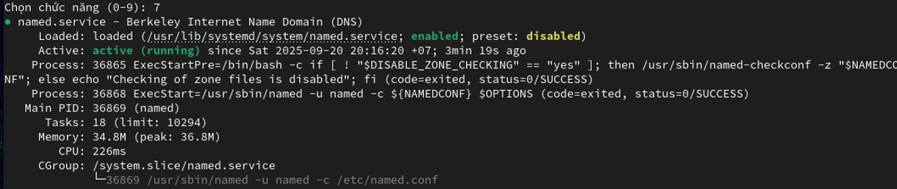
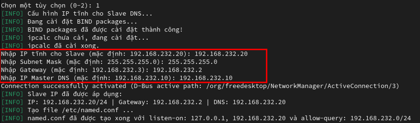
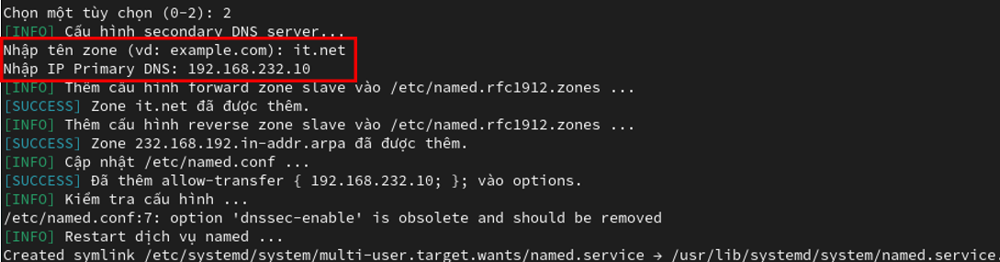

# 🌐✨ Quản lý DNS Server bằng Bash Script ✨🌐

## 📖 I. Giới thiệu

Script này được viết để tự động hóa việc cài đặt, cấu hình và quản lý BIND DNS Server trên hệ điều hành CentOS.

Mục tiêu của script là giúp người dùng dễ dàng thực hiện các tác vụ sau:

- Tự động cài đặt BIND và các gói phụ thuộc cần thiết.
- Cấu hình địa chỉ IP tĩnh và tệp `named.conf`.
- Tạo **Forward Zone** (phân giải xuôi) và **Reverse Zone** (phân giải ngược).
- Thêm các bản ghi DNS như A và PTR.
- Cấu hình **DNS Secondary** (máy chủ DNS phụ).
- Kiểm tra trạng thái của dịch vụ `named`.

Đây là một công cụ dạng menu CLI (giao diện dòng lệnh), người dùng chỉ cần chạy script và chọn chức năng mong muốn thông qua các con số.

## ⚙️ II. Chuẩn bị môi trường

Để sử dụng script, bạn cần đảm bảo các yêu cầu sau:

- **Hệ điều hành**: Máy chủ CentOS (khuyến nghị sử dụng CentOS Stream 9).
- **Kết nối mạng**: Cần có kết nối Internet để cài đặt các gói `bind`, `bind-utils`, và `ipcalc`. Cả hai máy chủ Primary và Secondary đều phải kết nối được ra ngoài.
- **Quyền truy cập**: Script cần được thực thi với quyền `root`.
- **Đảm bảo cả 2 máy Primary và Secondary có thể kết nối mạng bên ngoài**


## 🛠️ III. Hướng dẫn cài đặt

### Trên Primary DNS Server

1.  Tạo file script:
    ```bash
    touch primary.sh
    ```
2.  Cấp quyền thực thi cho file:
    ```bash
    chmod +x primary.sh
    ```
3.  Dán toàn bộ nội dung script vào file `primary.sh` vừa tạo.
4.  Chạy script với quyền root:
    ```bash
    ./primary.sh
    ```

### Trên Secondary DNS Server

1.  Tạo file script:
    ```bash
    touch secondary.sh
    ```
2.  Cấp quyền thực thi cho file:
    ```bash
    chmod +x secondary.sh
    ```
3.  Dán toàn bộ nội dung script vào file `secondary.sh` vừa tạo.
4.  Chạy script với quyền root:
    ```bash
    ./secondary.sh
    ```

> **Lưu ý**: Bạn nên tạo file và cấp quyền bằng tài khoản người dùng thông thường để dễ dàng dán nội dung script, sau đó chuyển sang `root` để chạy file.

## 🖥️ IV. Hướng dẫn sử dụng

### 1. Cấu hình trên Primary DNS Server

Khi chạy `primary.sh`, bạn sẽ thấy một menu chức năng. Hãy thực hiện tuần tự theo các bước sau.


1.  **Chức năng 1: Cài đặt và cấu hình cơ bản**

    - Chọn chức năng số `1` để cài đặt BIND và các gói cần thiết.
    - Nhập các thông tin mạng để cấu hình IP tĩnh, ví dụ:
      - Địa chỉ IP: `192.168.232.10`.
      - Subnet mask: `255.255.255.0`.
      - Gateway: `192.168.232.2`.

    

2.  **Chức năng 2: Tạo Forward Zone**

    - Chọn chức năng số `2` để tạo một zone phân giải xuôi mới.
    - Nhập tên miền và địa chỉ IP tương ứng, ví dụ: domain `it.net` với IP `192.168.232.10`.

    

3.  **Chức năng 3: Thêm DNS Record**

    - Chọn chức năng số `3` để thêm bản ghi cho zone đã tạo.
    - Chọn zone bạn muốn thao tác từ danh sách (ví dụ: `it.net`).

    

    - Nhập hostname và địa chỉ IP cho bản ghi mới (ví dụ: hostname `www` với IP `192.168.232.11`).

    

4.  **Chức năng 4 & 5: Xem thông tin**

    - Sử dụng chức năng số `4` để xem danh sách các Forward và Reverse Zone đã tạo.

    

    - Sử dụng chức năng số `5` để xem tất cả các bản ghi của một zone cụ thể.

    

5.  **Kiểm tra phân giải (Forward & Reverse Lookup)**

    - Thoát script và dùng lệnh `nslookup` để kiểm tra.
    - **Forward Lookup**: `nslookup it.net` sẽ trả về `192.168.232.10` và `nslookup www.it.net` sẽ trả về `192.168.232.11`.

    

    - **Reverse Lookup**: `nslookup 192.168.232.11` sẽ trả về `www.it.net`, xác nhận Reverse Zone đã được cấu hình chính xác.

    

6.  **Chức năng 6: Cấu hình Secondary DNS**

    - Chọn chức năng số `6`.
    - Nhập thông tin cho máy chủ Secondary, ví dụ:
      - Tên zone: `it.net`.
      - Hostname của Secondary: `secondary.it.net`.
      - Địa chỉ IP của Secondary: `192.168.232.20`.

    

7.  **Chức năng 7: Kiểm tra trạng thái dịch vụ**

    - Chọn chức năng số `7` để đảm bảo dịch vụ `named` đang chạy và các zone đã được tải thành công.

    

8.  **Hoàn tất cấu hình Primary**

    - Sau khi hoàn thành 7 chức năng trên, hãy chuyển Network Adapter của máy Primary sang chế độ **Host-only**.

      

### 2. Cấu hình trên Secondary DNS Server

Khi chạy `secondary.sh`, bạn thực hiện tuần tự các bước sau.


1.  **Chức năng 1: Cài đặt và cấu hình cơ bản**

    - Chọn chức năng số `1` để cài đặt BIND.
    - Nhập các thông tin mạng, bao gồm IP của Master DNS, ví dụ:

      - IP tĩnh: `192.168.232.20`.
      - Subnet mask: `255.255.255.0`.
      - Gateway: `192.168.232.2`.
      - IP của Master DNS: `192.168.232.10`.

      

    - Sau đó, chuyển Network Adapter của máy Secondary sang chế độ **Host-only**.

    

2.  **Chức năng 2: Cấu hình Secondary Zone**

    - Chọn chức năng số `2`.
    - Nhập tên zone cần đồng bộ (ví dụ: `it.net`) và địa chỉ IP của Primary DNS (ví dụ: `192.168.232.10`).

    

    - Sau đó kiểm tra trạng thái DNS Server, xác nhận dịch vụ named đang chạy và các zone đã được load đúng.

    

3.  **Kiểm tra đồng bộ và phân giải**

    - **Trên Secondary**: Dùng `nslookup` để kiểm tra. Kết quả phải cho thấy các bản ghi đã được đồng bộ từ Primary:

      - `it.net` -> `192.168.232.10`.
      - `www.it.net` -> `192.168.232.11`.
      - `secondary.it.net` -> `192.168.232.20`.

      

      - Kiểm tra Reverse Lookup cũng phải trả về kết quả tương ứng (`192.168.232.11` -> `www.it.net`, `192.168.232.20` -> `secondary.it.net`).

      

    - **Trên Primary**: Quay lại máy Primary và kiểm tra xem nó có thể phân giải được Secondary DNS hay không:
      - Forward Lookup: `nslookup secondary.it.net` -> `192.168.232.20`.
      - Reverse Lookup: `nslookup 192.168.232.20` -> `secondary.it.net`.

    

Kết quả kiểm tra chéo thành công xác nhận rằng cả hai máy chủ DNS đã được cấu hình đúng và đồng bộ với nhau.

<h3 align="center">🎉 Chúc bạn thành công! 🎉</h3>
